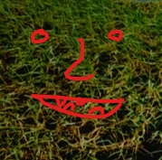

## Johan Malmros   
### JoMaTech
A former network engineer that merged the legacy, with the furture cloud technology and with main focus around security. I see myself as a hybrid security engineer! 
Call it Information security, IT security or Cybersecurity, they are equally important domains that i try to learn more about.

Welcome to this site, there I post arcticles that I believe are intersing and worth saving for future use - both for myself and others!
My mission are to have short articles, since we all lack the time to read to much!
To accomplish this I try to use:
- "A picture is worth a thousand words" 
- Short text
- Infographics

Let's start the securitiy journey!

* **Blog** =          [https://jomatech.github.io](https://jomatech.github.io)
* **GitHub** =        [https://github.com/jomatech](https://github.com/jomatech)